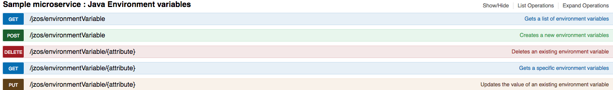

# JZOS Sample

Branch Specific version that shows how to incorporate into API Mediation layer 

The primary purpose of this project is to act as a sample microservice that demonstrates how RestAPI's can be used to surface z/OS functionality for more general availability of the function.

The sample provides access to Java System environmental variables allowing users CRUD types access to items such as "JAVA_HOME".

## Usage
The sample presents four functions centered around the notional "environmental variable" object

## Development and testing
The project is built using Maven and Testing and Code Coverage plugins are configured to provide developers with a start point for their own projects.

* Requirements
To build this project it is necessary to configure access to a Maven based repository that contains both JZos.jar and Atlas utilities.jar.
* JZos.jar provides the base functionality that is being surfaced
* Atlas utilities.jar provides common functionality used in Atlas that includes logging, HTTP and JSON for example.
* Building
* Execute mvn clean and verify for a basic build and test or mvn clean install jacoco:prepare-agent install jacoco:report to output Jacoco reporting also.
* Executing the Microservice
* The build creates a war file that can be added to a server running Atlas.

## Contributing
The intention is that third parties wanting to create their own Atlas samples will copy this project and use it as a basis for their own Atlas contribution
